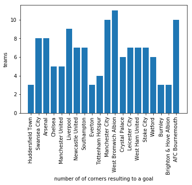

# football-corners-analysis
This repository provides Information and analysis of corners played in PL 2017/2018

## Table of Contents
* [General Info](#general-information)
* [Setup](#setup)
* [Conclusions](#conclusions)
* [Room for Improvement](#room-for-improvement)
* [Acknowledgements](#acknowledgements)
* [Contact](#contact)

## General Information
39% of goals scored in Fifa world cup 2018 came from set-pieces. That speaks volumes about the importance of set-pieces in determining the winner of Football matches. This project aims to analyze the teams' strategy in performing corners.  
Here are some interesting facts:  
1- The goals that resulted indirectly within 15 Second from a corner through corners is more than the direct (assisted) goals.  
2- Teams prefer the long cornersو and rightfully so. The chance of scoring from a long corner is way higher than the short one. Also, the chance of losing the ball and conceding a goal by counter attach is higher in the case of short corners.  
3- For some teams, e.g. Tottenham, the chance of scoring a goal through an open play is higher than scoring from a corner.  
4- The most effective corners are the ones that sent to the area between the six yards and the penalty mark.  

## Setup
The [requirements.txt](./requirements.txt)  file list the required Python dependencies and link to free event data provided by wyscout. 

## Conclusions

The most dangerous area is between the six yards and the penalty mark.
)

I saw this excellent project by [@Andrey](https://github.com/hesussavas). He suggests that corners lead to goals only 1.27% of the time which is true if we only considers the assists, but a corner chance is more than just assist opportunity. Sending the ball into opponent's penalty area could lead to indirect goals. Here is a comparison between goals scored after a corner for diffent periods 
)

The downside is that, in order to captilize on a corner chance you have to send your defenders forward,because they are usually the best players with kicking the ball with their head that leaves the team susceptible to all kinds of counter attacks. Here is the number of goal concceded by a team after having a corner
)

 Most Teams prefer long corners and rightfully so. Long corners are way more effective than short corners
) 
)

Here are the number and precentage of corners lead to a goal by a team
)
)

## Project Status
Project is: in progress

## Room for Improvement
Include areas you believe need improvement / could be improved. Also add TODOs for future development.

Room for improvement:
- analyzing more matches
- using tracking data instead of event data to extract more data  about the posiotn of all players

To do:
- How the heigh of players affect the goal probabilty

## Acknowledgements
Give credit here.
-This project was inspired by [@Andrey](https://github.com/hesussavas)
- Many thanks to wyscout for provide free event data 

## Contact
Created by [@mohamedgamea](mailto:mohamedgamea811@email.com/) - feel free to contact me!
